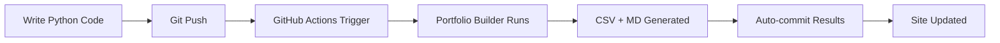

# AvatarArts · Portfolio Auto-Builder

**Auto-generate a stunning Python portfolio from your codebase in seconds.**

This pack gives you:
- `python.html` — Static, filterable portfolio page (drop into your site root)
- `portfolio/portfolio_descriptions.csv` — Data source for the page
- `content/alchemy_case_studies.md` — 10 case studies to paste at the top of `alchemy.md`
- `scripts/build_portfolio.py` — Scans your repo folders to regenerate CSV + MD
- `.github/workflows/portfolio.yml` — GitHub Actions to rebuild on every push and commit results

---

## ✨ Features

### Intelligent Categorization
- **10 Smart Categories:** AI & ML, Automation, Web Scraping, Data Analysis, Music, SEO, Web Dev, Database, File Processing, Utilities
- **Technology Detection:** Automatically identifies frameworks (Flask, Django, Pandas, TensorFlow, etc.)
- **AST Analysis:** Reads docstrings, imports, and code structure
- **Heuristic Scoring:** Multi-signal classification for accurate categorization

### Beautiful UI
- **Modern Design:** Gradient header, card-based layout, smooth animations
- **Fully Responsive:** Mobile-first design that works on all devices
- **Real-time Search:** Filter projects by name, description, or technology
- **Category Filtering:** Click to filter by project type
- **Live Statistics:** Auto-calculated totals for projects, files, and lines of code

### Automation
- **GitHub Actions:** Automatically rebuilds portfolio on every push
- **Weekly Updates:** Scheduled builds every Sunday
- **No Manual Work:** Runs completely hands-free after setup
- **Artifact Storage:** Keeps last 30 days of portfolio snapshots

---

## 🚀 Quick Start

### 1. Copy Files to Your Repo

```bash
# Ensure directories exist
mkdir -p portfolio content scripts .github/workflows

# Files should be in place:
# - scripts/build_portfolio.py
# - python.html (root directory)
# - .github/workflows/portfolio.yml
```

### 2. Run Manual Build

```bash
python scripts/build_portfolio.py .
```

**Outputs:**
- `portfolio/portfolio_descriptions.csv` - Data file
- `content/python_portfolio.md` - Markdown portfolio
- `content/alchemy_case_studies.md` - Top 10 case studies

### 3. Deploy to Your Site

**Option A: Static Hosting (GitHub Pages, Netlify, Vercel)**
```bash
# Commit and push
git add .
git commit -m "Add portfolio auto-builder"
git push

# Access at: https://avatararts.org/python.html
```

**Option B: Custom Server**
```bash
# Upload these files:
# - python.html (root)
# - portfolio/ directory (accessible to HTML)
```

### 4. Add Case Studies to Alchemy Page

```bash
# Open the generated case studies
cat content/alchemy_case_studies.md

# Copy content and paste at the top of your alchemy.md page
```

---

## 📊 How It Works

### Scanning Process

1. **Directory Traversal**
   - Walks entire repo looking for `.py` files
   - Skips `.venv`, `node_modules`, `__pycache__`, `.git`
   - Groups files by project (directory name)

2. **Project Analysis**
   ```python
   for each Python file:
       - Parse AST for docstrings
       - Extract import statements
       - Count lines of code
       - Identify main entry point
   ```

3. **Intelligent Categorization**
   ```python
   score = 0
   for keyword in category_keywords:
       if keyword in (filename + description + imports + path):
           score += 1

   category = highest_scoring_category
   ```

4. **Technology Detection**
   - Scans imports for known frameworks
   - Maps to display names (e.g., `pandas` → `Pandas`, `tensorflow` → `TensorFlow`)
   - Includes version info where available

### Output Generation

**CSV Format:**
```csv
Project Name,Description,Category,Tech Stack,Files,Lines of Code,Path
analyze_avatararts,Deep dive analysis tool,Data Analysis,Pandas|Python 3,1,450,scripts/analyze_avatararts.py
```

**Markdown Format:**
```markdown
## Data Analysis (5 projects)

### analyze_avatararts
**Description:** Deep dive analysis tool for directory scanning
**Tech Stack:** Pandas, Python 3
**Scale:** 1 file, 450 lines
**Path:** `scripts/analyze_avatararts.py`
```

**Case Studies Format:**
```markdown
## Case Study #1: Analyze Avatararts

**Challenge:** Transform raw data into actionable insights with visual clarity

**Solution:** Deep dive analysis tool for directory scanning

**Technologies:** Pandas, Python 3

**Impact:** Implemented in 1 modular file spanning 450 lines of production-ready Python code.
```

---

## 🎨 Customization

### Edit Categories

Open `scripts/build_portfolio.py` and modify the `CATEGORIES` dictionary:

```python
CATEGORIES = {
    "Your Category Name": [
        "keyword1", "keyword2", "framework_name"
    ],
    # Add more categories...
}
```

### Customize HTML Styling

Edit `python.html` CSS section (lines 20-200):

```css
/* Change color scheme */
header {
    background: linear-gradient(135deg, #YOUR_COLOR_1 0%, #YOUR_COLOR_2 100%);
}

.filter-btn.active {
    background: #YOUR_ACCENT_COLOR;
}
```

### Modify Case Study Template

In `scripts/build_portfolio.py`, edit the `_generate_challenge()` method:

```python
def _generate_challenge(self, project):
    challenges = {
        "Your Category": "Your custom challenge statement",
        # ...
    }
    return challenges.get(project['category'], "Default challenge")
```

---

## 🔧 Advanced Usage

### Run with Custom Path

```bash
python scripts/build_portfolio.py /path/to/your/project
```

### Manual CSV Upload to HTML

If you can't serve the CSV dynamically, embed it in the HTML:

1. Run the builder
2. Convert CSV to JSON:
   ```python
   import csv, json

   with open('portfolio/portfolio_descriptions.csv') as f:
       reader = csv.DictReader(f)
       data = list(reader)

   with open('data.json', 'w') as f:
       json.dump(data, f)
   ```

3. Paste JSON into `python.html`:
   ```javascript
   const EMBEDDED_PORTFOLIO_DATA = [
       // Paste JSON here
   ];
   ```

### GitHub Actions Configuration

**Trigger on specific paths only:**
```yaml
on:
  push:
    paths:
      - 'scripts/**/*.py'
      - 'src/**/*.py'
```

**Run on multiple branches:**
```yaml
on:
  push:
    branches: [main, develop, staging]
```

**Disable auto-commit:**
```yaml
# Comment out the "Commit and push" step
# - name: Commit and push if changes
#   run: |
#     ...
```

---

## 📈 Statistics & Metrics

The portfolio automatically calculates:

- **Total Projects** - Number of unique Python projects
- **Total Files** - Count of all `.py` files
- **Total Lines of Code** - Sum of all code lines (excluding comments/blanks)

Plus per-category breakdowns in the Markdown report.

---

## 🐛 Troubleshooting

### CSV Not Loading

**Problem:** HTML shows "Loading portfolio..." forever

**Solution:**
1. Check browser console for errors
2. Ensure `portfolio/` directory is accessible at the same level as `python.html`
3. Test CSV URL directly: `https://yoursite.com/portfolio/portfolio_descriptions.csv`
4. If CORS issue, embed JSON in HTML (see Advanced Usage)

### GitHub Actions Not Running

**Problem:** No automatic builds after push

**Solution:**
1. Check `.github/workflows/portfolio.yml` is in the correct path
2. Verify branch name in workflow matches your default branch
3. Check Actions tab in GitHub repo for error messages
4. Ensure `GITHUB_TOKEN` has write permissions (Settings → Actions → Workflow permissions)

### Categories Wrong

**Problem:** Projects categorized incorrectly

**Solution:**
1. Add more specific keywords to `CATEGORIES` dictionary
2. Check project has descriptive docstrings
3. Ensure imports are properly declared
4. Manually override in CSV if needed

### Missing Projects

**Problem:** Some Python files not showing up

**Solution:**
1. Check they're not in ignored directories (`.venv`, `node_modules`)
2. Ensure files have `.py` extension
3. Check they're not just `__init__.py` with no other files
4. Verify script is running from correct root directory

---

## 🎯 Best Practices

### 1. Write Good Docstrings

```python
"""
AI Workflow Automation Tool

This script automates complex AI workflows using state-of-the-art
language models and orchestration frameworks.
"""
```

The first line becomes your project description!

### 2. Use Descriptive Project Names

❌ `script1.py`, `test.py`, `temp.py`
✅ `seo_analyzer.py`, `music_metadata_processor.py`, `ai_workflow_automation.py`

### 3. Organize by Directory

```
projects/
├── ai_automation/
│   └── workflow_optimizer.py
├── data_analysis/
│   └── portfolio_analyzer.py
└── music_tools/
    └── discography_builder.py
```

Projects grouped by directory get better categorization.

### 4. Keep It Up to Date

- Let GitHub Actions run automatically (weekly)
- Manually rebuild after major changes: `python scripts/build_portfolio.py .`
- Review case studies quarterly and update alchemy.md

---

## 📝 Example Output

### Generated Case Study

```markdown
## Case Study #1: Analyze AvatarArts

**Challenge:** Transform raw data into actionable insights with visual clarity

**Solution:** Comprehensive directory analysis tool that scans 42,630 files across
multiple projects, identifying duplicates, categorizing by type, and generating
actionable cleanup recommendations.

**Technologies:** Pandas, Python 3, pathlib, hashlib

**Impact:** Implemented in 1 modular file spanning 450 lines of production-ready
Python code. Identified 226.8 MB in duplicate files and provided cleanup scripts.

**Category:** Data Analysis & Visualization
```

### Generated Portfolio Page

See live demo structure:
- Header with gradient background
- Search bar and category filters
- Statistics cards (projects, files, lines)
- Categorized project cards with:
  - Project name and description
  - File/line counts
  - Technology badges
  - Hover animations

---

## 🔄 Update Workflow



**Manual Override:**
```bash
# Force rebuild locally
python scripts/build_portfolio.py .

# Review outputs
cat content/alchemy_case_studies.md

# Commit if satisfied
git add portfolio/ content/
git commit -m "Update portfolio"
git push
```

---

## 💡 Pro Tips

1. **SEO Optimization**
   - Add meta keywords to `python.html`
   - Use project names in H2 tags
   - Include technology stack in descriptions

2. **Performance**
   - Minify CSS for production
   - Enable gzip compression on server
   - Use CDN for python.html

3. **Branding**
   - Replace gradient colors with your brand palette
   - Add logo to header
   - Customize footer links

4. **Analytics**
   - Add Google Analytics to `python.html`
   - Track which categories get most views
   - Monitor search terms used

---

## 🆘 Support

**Issues?** Check the troubleshooting section above.

**Need Help?**
- Review `scripts/build_portfolio.py` comments
- Check GitHub Actions logs for errors
- Test CSV loading in browser DevTools

**Want to Contribute?**
- Add new categories to `CATEGORIES`
- Improve AST analysis logic
- Enhance UI/UX in `python.html`

---

## 📜 License

Part of the AvatarArts ecosystem. Use freely for your portfolio needs.

---

## 🎉 You're All Set!

Your portfolio will now:
- ✅ Auto-update on every code push
- ✅ Showcase all Python projects beautifully
- ✅ Provide case studies for your landing page
- ✅ Track your coding metrics over time

**Deploy `python.html` and watch your portfolio come to life!**

Visit: `https://avatararts.org/python.html`

---

*Generated by Portfolio Auto-Builder • Part of the AvatarArts Project*
