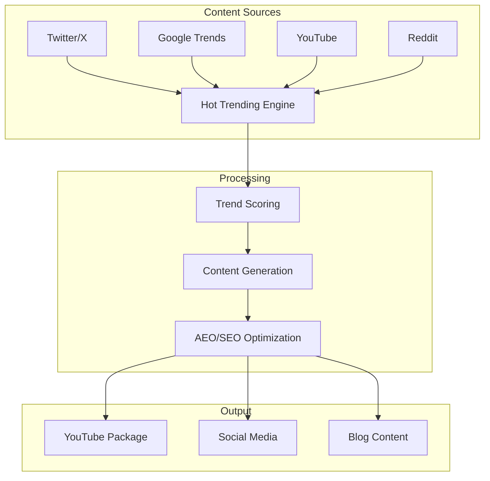

# System Overview

The SEO Content Optimization Suite is a comprehensive system for discovering hot trending topics, generating SEO-optimized content, and maximizing exposure across all platforms.

## Architecture

## Core Components

### 1. Hot Trending Content Engine

Discovers hot trending topics across multiple platforms and generates complete SEO-optimized content packages.

!!! info "Key Features"
    - Real-time trend discovery (Grok, Perplexity, Gemini, Groq)
    - Multi-platform intelligence aggregation
    - Trend scoring (0-100) with growth rate analysis
    - Complete content package generation

### 2. YouTube SEO Optimizer

Generates SEO-optimized YouTube video packages with titles, descriptions, tags, and performance estimates.

!!! info "Key Features"
    - SEO-optimized title generation (55-60 characters)
    - Complete description with timestamps
    - 10-15 optimized tags
    - SEO score calculation (0-100)

### 3. Multi-Platform Content Extractor

Extracts content from multiple platforms (Ideogram.ai, Suno) with rich metadata and content-aware analysis.

!!! info "Key Features"
    - Browser automation (Selenium)
    - Rich metadata extraction
    - Content-aware analysis
    - CSV/JSON export

## Workflow

1. **Trend Discovery** — Scan platforms for hot trends
2. **Content Generation** — Create SEO-optimized content
3. **Optimization** — Calculate SEO/AEO scores
4. **Export** — Save content packages
5. **Publish** — Distribute across platforms

## Integration

The system integrates with:

- **18+ AI Services** for intelligent content creation
- **Content Management** systems
- **Publishing Platforms** (YouTube, social media)
- **Analytics** for performance tracking

